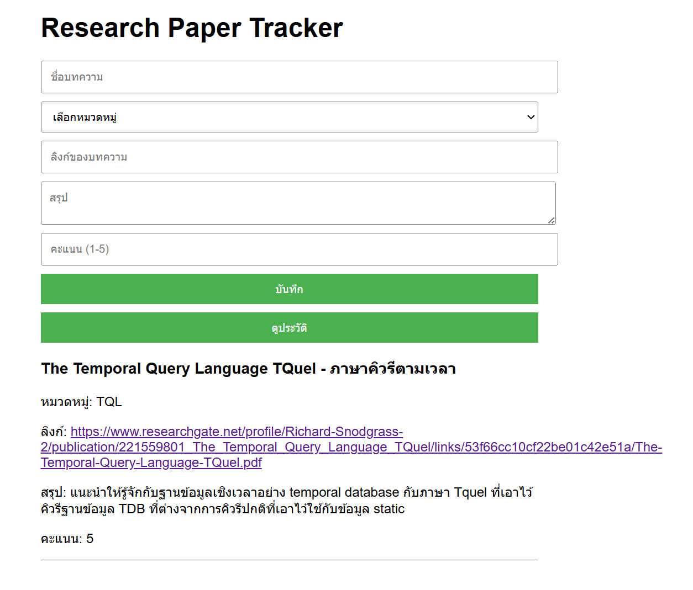

# Research Paper Tracker

Research Paper Tracker เป็นแอปพลิเคชันเว็บที่ช่วยในการจัดการและติดตามงานวิจัยที่คุณอ่านได้อย่างมีระเบียบและง่ายดาย

## คุณสมบัติหลัก

- **บันทึกข้อมูล:** บันทึกชื่อบทความ, หมวดหมู่, ลิงก์, สรุป, และคะแนนการประเมิน
- **การจัดหมวดหมู่:** เพิ่มหมวดหมู่ใหม่และเลือกจากหมวดหมู่ที่มีอยู่
- **ดูประวัติ:** ดูบทความทั้งหมดที่บันทึกไว้พร้อมกับรายละเอียด
- **การใช้งานง่าย:** ออกแบบให้ใช้งานง่ายและมีประสิทธิภาพ

## วิธีการใช้งาน

1. **เปิดแอปพลิเคชัน:** เปิดไฟล์ HTML ในเว็บเบราว์เซอร์ของคุณ
2. **บันทึกข้อมูล:** กรอกข้อมูลบทความ, เลือกหมวดหมู่, และใส่ลิงก์
3. **คลิกปุ่ม "บันทึก":** เพื่อบันทึกข้อมูล
4. **ดูประวัติ:** คลิกปุ่ม "ดูประวัติ" เพื่อดูบทความทั้งหมดที่เคยบันทึกไว้

## เทคโนโลยีที่ใช้

- HTML
- CSS
- JavaScript (Local Storage)

## วิธีการติดตั้ง

ไม่จำเป็นต้องติดตั้งเพิ่มเติม ดาวน์โหลดไฟล์ HTML และเปิดใช้งานในเว็บเบราว์เซอร์

## เพิ่มเติม

โปรเจกต์นี้ถูกพัฒนาขึ้นเพื่อการศึกษาและการใช้งานส่วนตัว หากมีข้อเสนอแนะหรือปรับปรุง สามารถแก้ไขได้ตามต้องการ

